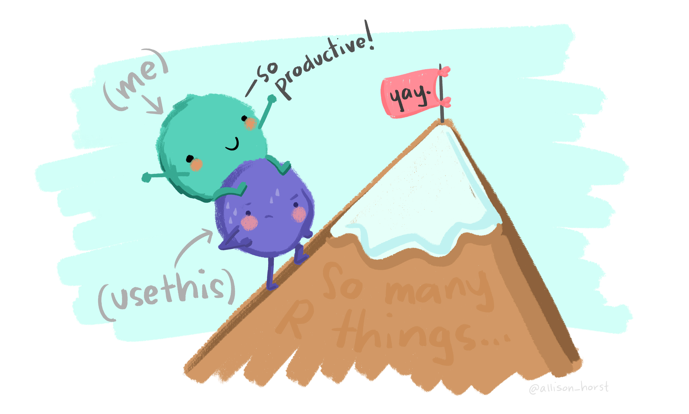
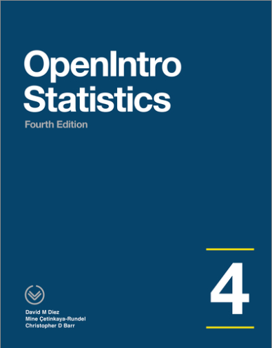

```{r setup, include = FALSE}
library(webexercises)
library(tinytex)
library(dplyr)
library(knitr)
library(ggplot2)
library(infer)

urlfile <- "https://raw.githubusercontent.com/StephenVillejo/S1Z.AnovaLab/main/surgery.csv"
surgery <- read.csv(url(urlfile))

knitr::opts_chunk$set(echo = FALSE)
```

```{r eval=FALSE, echo=FALSE}
install.packages("bookdown")
```

```{r include=FALSE, echo=FALSE}
knitr::write_bib(c(
  .packages(), 'bookdown', 'knitr', 'rmarkdown'
), 'packages.bib')
```

# Welcome to S1Z Lab 2 {-}

```{r graphic1, echo = FALSE, out.width = "100%", fig.cap = ""}

```

In this lab activity, we will learn how to perform an ANOVA using R. The material within this lab has been based on OpenIntro Chapters 7 
<a href="https://www.openintro.org/redirect.php?go=os4_tablet&referrer=/stat/os4.php#page=285">OpenIntro Page 285</a>. Feel free to refer back to the materials to help you with this lab. 

## Load packages {.unnumbered}

To run the code that appears in the consoles in this lab start by loading these packages.

```{r load-packages, echo=TRUE, eval=FALSE}
library(tidyverse)
library(infer)
```

To run the code that appears in the consoles in this lab in **your own version of RStudio**, make sure the packages above are installed. You can install packages using the `install.packages("package name")` command. For example, to install `tidyverse` you should run the line `install.packages("tidyverse")`.
<br>

**Credit where credit is due**


The labs in S1Y/Z are a derivative of the labs on the <a href="https://www.openintro.org/book/os/">OpenIntro Statistics website</a> by the <a href="https://www.openintro.org/team/"> OpenIntro team</a> used under a <a href="https://creativecommons.org/licenses/by-sa/4.0/">Creative Commons Attribution-ShareAlike 4.0 International License</a>. Some of the artwork used is by <a href="https://github.com/allisonhorst/stats-illustrations">@allison_horst</a>

<br>
